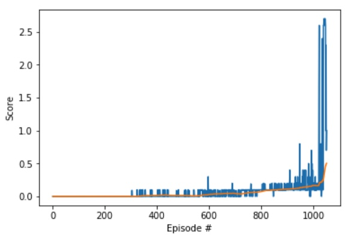

# Collaboration and Competition Project Report

## Learning Algorithm

The Learning Algorith is based on the the [Deep Determanistic Policy Gradient (DDPG) implementation](https://github.com/udacity/deep-reinforcement-learning/blob/master/ddpg-bipedal/ddpg_agent.py). In this algorithm, it will be used a **Replay Buffer**, shared among agents, a memory of BUFFER_SIZE = 1e5 cells, where it will be stored tuples, one for each agents, made of:
```
(state,action,reward,next_state, episode_end)
```
If are available enough examples into Replay Buffer (more than batch size), every **n_step** (set to 1) and for **n_times** (set to 2) it will be extracted (dequed) a random batch of examples to be used for network weights updates, the so called learning phase.

In this algorithm we merge the policy and values-based approach, usually named **Critic/Actor**:
- a Critic measures how good the action taken is (value-based)
- an Actor controls how our agent behaves (policy-based)

2 Neural Networks that are a set of θ (weights), one for each Actor/Critic network will be used, defined as follow:

**Actor**:

- Input layer: 33
- fully connected layer: units=128
- activation: ReLU
- batch normalization layer
- fully connected layer: units=128
- activation: ReLU
- fully connected: 4
- Output activation: tanh()

**Critic**:

- Input layer: 33
- fully connected layer: units=128
- activation: ReLU
- batch normalization layer
- fully connected layer: units=128 + 4 (actions)
- activation: ReLU
- Output fully connected: 1


To update weights, it will be used this formula:
```
Q_targets = r + γ * critic_target(next_state, actor_target(next_state))
```
where:
- actor_target(state) -> action
- critic_target(state, action) -> Q-value

Params:
- experiences (Tuple[torch.Tensor]): tuple of (s, a, r, s', done) tuples 
- gamma (float): discount factor

Note: this is the reason why the second fully connected layer into Critic Network takes in input a tensor with action, the actor_target() output. 

The final update is done using the "local" copy of actor/critic network weights, with a so called "soft update" to the "target" copy of actor/critic network weights, following this formula:
```
θ_target = τ*θ_local + (1 - τ)*θ_target
```

Training optimizer used it's an Adam with a learning rate of 2e-4 for both networks, with a weight decay of 0 and a batch size of 128.

For the environment has been used 2 Agents getting the max score for episode reached between them, and it reached the target average score of 0.5 over 100 consecutive episodes after 951 episodes, with Average Score: 0.50. 
Partial scores were:
```
Episode 100 	 Episode Score 0.00  	Average Score: 0.00
Episode 200 	 Episode Score 0.00  	Average Score: 0.00
Episode 300 	 Episode Score 0.00  	Average Score: 0.00
Episode 400 	 Episode Score 0.00  	Average Score: 0.01
Episode 500 	 Episode Score 0.00  	Average Score: 0.01
Episode 600 	 Episode Score 0.00  	Average Score: 0.03
Episode 700 	 Episode Score 0.09  	Average Score: 0.05
Episode 800 	 Episode Score 0.10  	Average Score: 0.07
Episode 900 	 Episode Score 0.20  	Average Score: 0.11
Episode 1000 	 Episode Score 0.10  	Average Score: 0.16
Episode 1051 	Average Score: 0.50
```

The progress chart has been:
<p align="left">
  
</p>


## Further Improvement

Several improvements might be done as implementing an AlphaZero algorithm.
